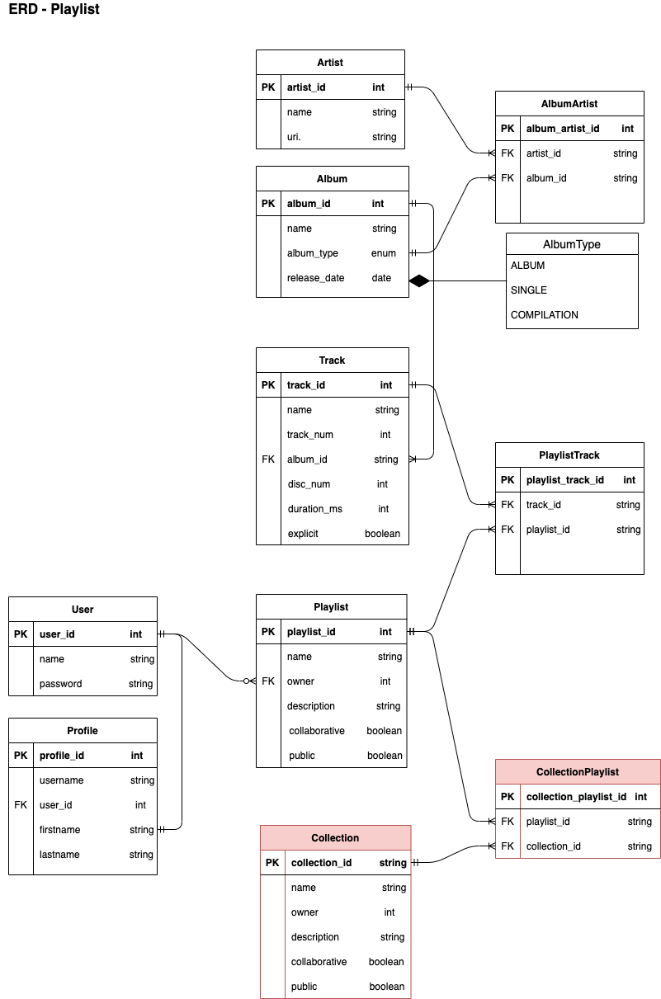

# Introduction
## Objective
The objective of this project is to implement a system with data and application layer for extended features proposed in T3A2.

**R1:** The extended features suggested is to implement a feature called collection for existing Spotify system. Collection will populate several playlist and help to keep user interface to stay neat and tidy.

**R2:** [Report : Privay and Security Analysis](docs/report_privacy_security.md)

**R3:** [Report : Professional, Ethical and Legal Obligations](docs/report_prof_ethical_legal.md)

**R4, R9:** The models is implemented using PostgreSQL database with one-to-one, one-to-many and many-to-many relationships. The application is using Object Relational Mapping (ORM) SqlAlchemy to interact with its database. SQLAlchemy Marshmallow schemas are used to serialise, deserialise and validate data to and from the database and application for the view component. This is the ERD that is used to build the application.



## Help and Installation Guide
### Project and environment setup
*System Requirement*: Ensure that **Python3** is installed all dependecies on your machine.
* Clone the repository to your local machine
    ```
    git clone https://github.com/hholly3003/Holly_T3A3.git
    ```
* Create virtual environment and activate
    ``` 
    python3 -m venv venv
    source venv/bin/activate
    ```
* Install Dependencies
    ``` 
    pip install -r requirements.txt
    ```
* Run
    ```
    Navigate to directory of the main.py file that should be available under *src* folder.
    python main.py
    ```
### Database setup
* Install postgresql on your host
    ```
    sudo apt-get install postgresql
    ```
* Log into postgresql as postgres user
    ``` 
    sudo -u postgres psql
    ```
* Setup spotify_api database
    ``` 
    CREATE DATABASE spotify_api;
    ```
* Set up other variables within the .env folder. These secret keys can be anything you specify but cannot be left blank.
* Navigate to the src folder and export flask environment variables.
    ```
    export FLASK_ENV=development
    export FLASK_APP=main.py:create_app()
    ```

### Data Migration
* Initialise migrations
    ```
    flask db init
    ```
* Run the migration
    ```
    flask db upgrade
    ```
* Seeded some dummy data
    ```
    flask db-custom seed
    ```
* Drop all tables in database
    ```
    flask db-custom drop
    ```
